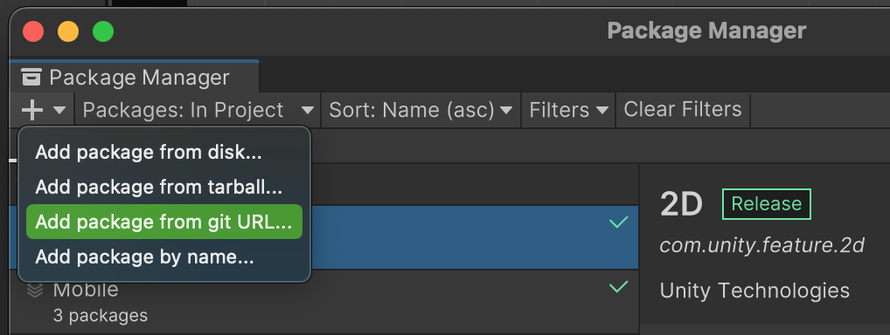
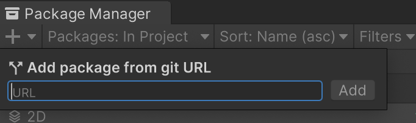

# breezetools
A collection helper tools for building mobile games in Unity

## Getting Started
1. Open the Package Manager in Unity and add from git

2. Enter https://github.com/breezinstein/breezetools.git?path=/com.breezinstein.tools

